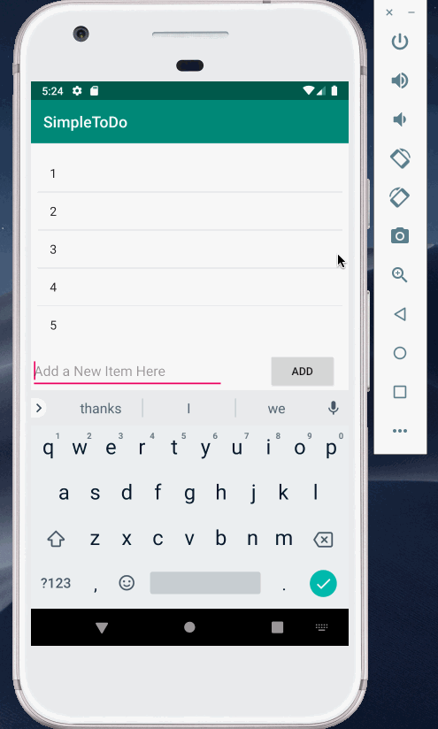

# Pre-work -*Simple To-do*
**Simple Todo** is an android app that allows users to keep track of items that need completion

Submitted by: **Aastha Shah**

##User Stories 

The following functionality is included 

* [ x] User can remove and add items from the todo list 
* [ x] List is stored even after the app closes 

##Video Walkthrough 
Here is a video of the walkthrough 

GIF created with [LiceCap] (https://www.cockos.com/licecap/)
